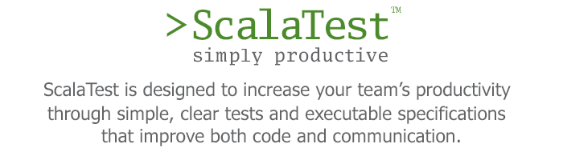
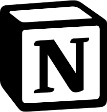
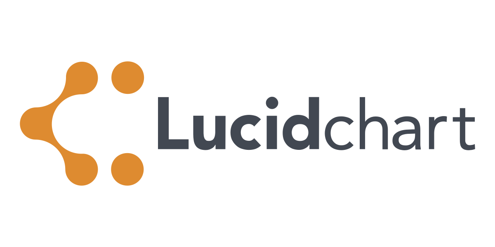
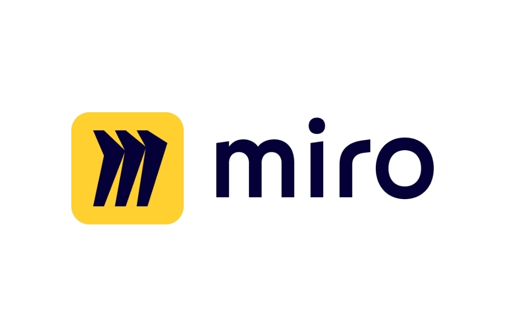

# Tools

For the realization of the project, different tools were used to support the development process. These tools aim to facilitate developers throughout the project realization.

### Jira
[Jira](https://www.atlassian.com/software/jira) is a proprietary software suite developed by Atlassian, which enables bug tracking and project management using agile methodologies. In particular, it allowed us to keep track of work division and organize the topics of various tasks.

### GitHub
[GitHub](https://github.com/) is a hosting service for software development and version control management based on Git. It provides Git's distributed version control along with access control, bug tracking, software feature requests, task management, continuous integration, and a wiki for every project.

For our project, we used GitHub as a hosting service for the source code, GitHub actions to promote the continuous integration process, and GitHub Pages for documentation and explanation of the system implemented.

#### Renovate 
[Renovate](https://docs.renovatebot.com/) is a GitHub application that automates dependency updates for software projects. It scans a project's dependencies and creates pull requests to update them to their latest versions. Renovate supports a wide range of programming languages and package managers, making it a versatile tool for maintaining software projects. It also has a range of configuration options that allow users to customize the update process to fit their specific needs.

#### Semantic Release
[Semantic Release](https://semantic-release.gitbook.io/semantic-release/) is a service that automates the package release process for software projects. It uses semantic versioning to determine the next version number and generates release notes based on commit messages. The app also updates the changelog, creates a Git tag, and publishes the new version to the package registry. This allows developers to streamline their release workflow and ensure that their software versions are consistent and correctly versioned.

#### Zenodo
[Zenodo](https://zenodo.readthedocs.io/en/latest/#) is a GitHub app that enables users to archive and share research data and software code. It provides a platform for researchers to preserve their work and make it accessible to others, while also enabling them to receive credit and recognition for their contributions. With Zenodo, users can upload any type of research output, including datasets, software code, presentations, and articles, and receive a DOI (Digital Object Identifier) that can be used to cite their work in academic publications. Zenodo is free to use and integrates seamlessly with GitHub repositories.

### Gradle
[Gradle](https://gradle.org/) is an open-source, JVM-based build automation tool that enables the automation of Java project building. It also makes it easy to set up different libraries that can be used within the project without the need to include .jar files but instead specifying dependencies directly from a remote repository. Gradle also allows the management of a project consisting of multiple modules and the different dependencies that may exist between them.

### ScalaTest
[ScalaTest](https://www.scalatest.org/) is a popular testing framework for the Scala programming language. It provides a broad set of features for different styles of testing, including unit, functional, and acceptance testing. ScalaTest supports a variety of testing approaches, such as Behavior-Driven Development (BDD) and Test-Driven Development (TDD), and provides a rich set of matchers to make assertions easier to read and write. The framework can be used with popular build tools like sbt and Maven, and supports integration with other Scala frameworks like Akka and Spark.

### Notion
[Notion](https://www.notion.so/) is a productivity and collaboration tool that allows users to create and organize notes, documents, tasks, databases, and more in a single workspace. It features a flexible and customizable interface, with the ability to create different types of content, such as text, tables, lists, calendars, and Kanban boards. Notion also supports real-time collaboration, allowing multiple users to work together on the same content simultaneously. It can be used for personal productivity, team collaboration, project management, knowledge management, and more. Notion has become a popular tool for remote teams and individuals looking for an all-in-one solution to manage their work and workflows.

### LucidChart
[Lucidchart](https://www.lucidchart.com/) is a cloud-based diagramming and visual communication tool that enables users to create and collaborate on a wide range of visual content, including flowcharts, diagrams, wireframes, mind maps, and more. It offers a drag-and-drop interface and a variety of pre-built templates and shapes, making it easy for users to create professional-looking visuals quickly. Lucidchart also supports real-time collaboration, allowing multiple users to work on the same diagram simultaneously. It integrates with other popular tools like Google Drive, Microsoft Office, and Confluence, and can be used for a range of use cases, including project management, software development, data visualization, and education.

### Miro
[Miro](https://miro.com/) is an online whiteboarding and collaboration platform that allows users to create and collaborate on a range of visual content, including diagrams, mind maps, user flows, wireframes, and more. It features a flexible and customizable interface, with a range of pre-built templates and shapes that make it easy for users to create professional-looking visuals quickly. Miro also supports real-time collaboration, enabling multiple users to work together on the same board simultaneously. It integrates with other popular tools like Jira, Trello, and Slack, and can be used for a range of use cases, including product design, agile planning, brainstorming, and remote collaboration.

