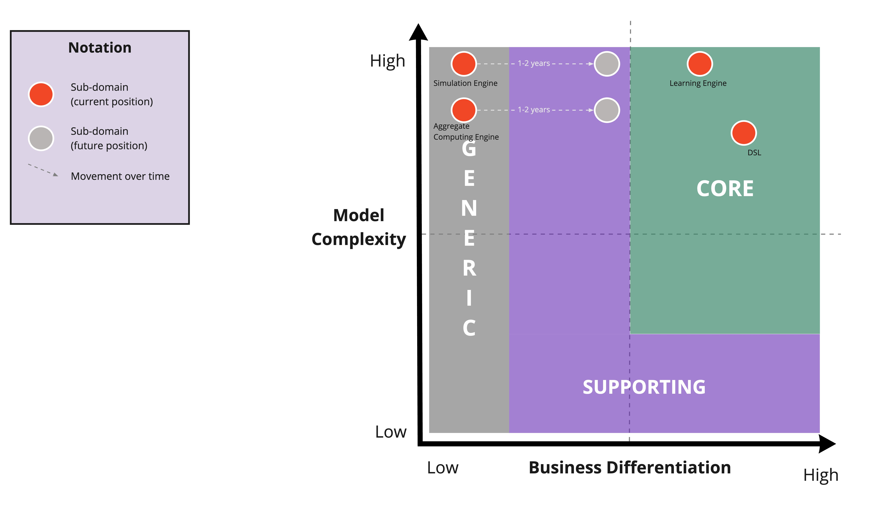

# Core Domain Chart

Following the identification of the requirements, the analysis was expanded in order to create a core domain chart aimed at categorizing sub-domains according to their strategic importance in the business.

The chart will report the sub-domains of ScaRLib; the x-axis indicates how much value the sub-domain brings to the business (or how much, in other words, it offers something that differentiates it from businesses that offer similar services), while the y-axis represents how complex the sub-domain is to implement.

