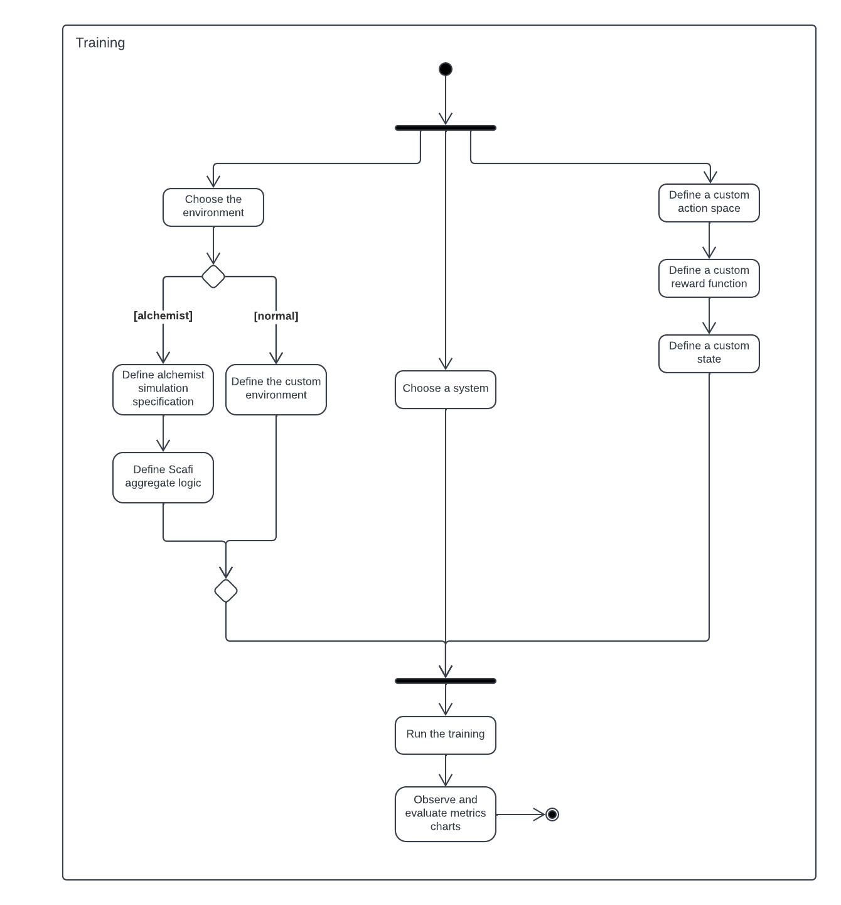

# Knowledge Crunching

## Interview

After analyzing the client's request and the making the impact map, we had an interview with one of the clients, it is reported below.

**Question 1**

**Analyst**: 
    In the request you asked us to develop a tool for Cooperative Many Agent Reinforcement Learning, with the term "many" what order of magnitude do you mean ?

**Domain expert**: 
    I mean that the tool has to be able to handle from hundreds of agents to about one or two thousand.

**Question 2**

**Analyst**: 
    In the description of the ad-hoc systems you are using you mentioned that you have used the tools Alchemist and Scafi, is the integration highly needed also in the new framework?

**Domain expert**:
    Yes, ideally we want a generic tool that can be integrated with other tools for simulation environment (e.g., Alchemist) and aggregate programming (e.g., Scafi). The default integration has to be with Alchemist and Scafi but since it is a generic tool we must be able to replace one (or all) of these two tools with another one (e.g., Alchemist with some other simulator).

**Question 3**

**Analyst**: 
    Let's suppose that the tool is ready, how do you expect to be able to use it to define your experiments?

**Domain expert**:
    I expect that I have to implement/define the concepts related to the specific experiment, for example the action space, then start the training and monitor it.

**Question 4**

**Analyst**:
    What do you mean with "monitor the training" ?

**Domain expert**:
    I mean that I would like to have both: 
        i) a live check of what the agents are learning and 
        ii) a posteriori evaluation of the learned policy.

**Question 5**

**Analyst**: 
    What do you mean with "live check"?

**Domain expert**:
    I mean that I would like to see the agents act and, moreover, to have some charts that resume some specified metrics (e.g., the sum of the rewards over the time).

**Question 6**

**Analyst**: 
    Are the graphs always the same or should they be customizable?

**Domain expert**:
    The charts must be customizable, in this way, depending on the specific experiment, the most relevant metrics can be plotted.

**Question 6**

**Analyst**: 
    Talking about the "a posteriori evaluation", you said that you would like to check the learned policy, is that policy the last one of the training process or is there the need for a snapshot mechanism, for example at any given step ?

**Domain expert**:
    A snapshot mechanism is needed! Usually the learning process is very unpredictable and, for example, a policy learned at the episode 500 may be better than one learned at the episode 650. 

**Question 7**

**Analyst**: 
    Regarding the specification of the experiments, in your opinion, what are the aspects that should be customizable in order to define a new task for the agents?

**Domain expert**:
    Surely: 
        i) the action space, 
        ii) the state, 
        iii) the reward function,
        iiii) and the environment in which the agents act.

**Question 8**

**Analyst**: 
    Regarding the learning algorithm, is the implementation of the DQN algorithm enough? Is there a need to implement other algorithms?

**Domain expert**:
    DQN is a very generic learning algorithm and it performs well on a wide range of tasks, so it is optimal as a default algorithm for the framework. However, the framework should offer the possibility to add new algorithms in an agile way.

**Question 9**

**Analyst**: 
    These algorithms make extensive use of neural networks, are the classical feed-forward neural networks sufficient or is there a need for more complex networks (e.g., Reccurent NN or Convolutional NN) ?

**Domain expert**:
    Feed-forward neural networks work well on a wide range of tasks, however, the framework should allow the user to define his own preferred neural network.
    I think that first the tool has to support feed-forward neural networks, then in the future, as soon as possible, there should also be the integration of more complex neural networks.

This is only one of the several interviews that we had with the clients, these interviews have been very important in being able to fully understand their needs.

## Activity diagram

Many activity diagrams were also developed during the various interviews. These diagrams gave the development team a better understanding of how the end user should interact with the framework. Below is an example of the activity diagram developed for the definition of a learning process.

