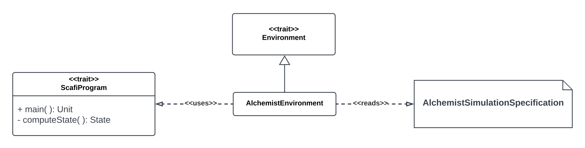

# alchemist-scafi

## Detailed design

The module `alchemist-scafi` provides the mapping of ScaRLib abstractions over the two tools: [Alchemist] and [Scafi].
It is composed by two key elements:
- `AlchemistEnvironment`, that implements a common `Environment` (defined in the `scarlib-core` module). It can be used like any other environment but underneath it actually interfaces with the alchemist simulator to exploit its potential.

- `ScafiProgram`, which expresses the aggregate logic that must be used to compute the state at a given time.

[Scafi]: https://scafi.github.io/
[Alchemist]: http://alchemistsimulator.github.io/