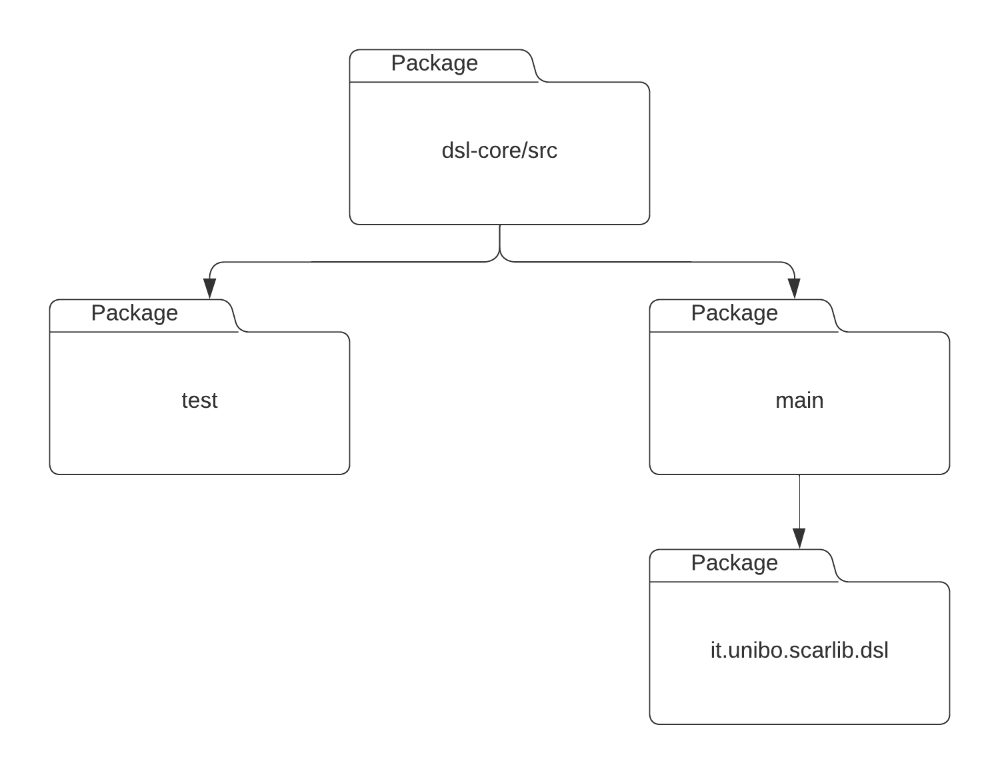

# dsl-core

The module `dsl-core`, contains an internal Domain Specific Language (DSL) for creating CMARL systems in a more agile and flexible manner.

## Usage

The DSL provided is a simple facade to the abstractions shown in the `scarlib-core` module. To start a new simulation the user has to define some custom components, once implemented the user can specify the system configuration with the DSL as follows:

```scala
val system = learningSystem {
	rewardFunction { new MyRewardFunction() }
	actions { MyAction.all}
	dataset { ReplayBuffer[State, Action](10000) }
	agents { 50 } // select the number of agent
	environment {
		// select a specific environment
		"it.unibo.scarlib.experiments.myEnvironment"
	}
}
```

## Detailed design

By leveraging the context functions of Scala 3, we were able to define a simple DSL for creating a system. The DSL is a simple facade to the abstractions provided by the scarlib-core module. The DSL is composed of a set of context functions that allow the user to specify the reward function, the action space, the dataset, the number of agents, and the environment. The context functions are defined as follows:

```scala
	def learningSystem(init: Unit ?=> Unit): CTDESystem
	def environment(init: Unit ?=> String)
	def rewardFunction(init: Unit ?=> RewardFunction)
	def actions(init: Unit ?=> Seq[Action])
	def dataset(init: Unit ?=> ReplayBuffer[State, Action])
	def agents(init: Unit ?=> Int)
```

## Code structure

<div align="center">

</div>

The structure of the dsl module is very simple, with only a package for the main sources. As expected, the test folder contains an usage example of the DSL while the main folder contains all the Scala source code.