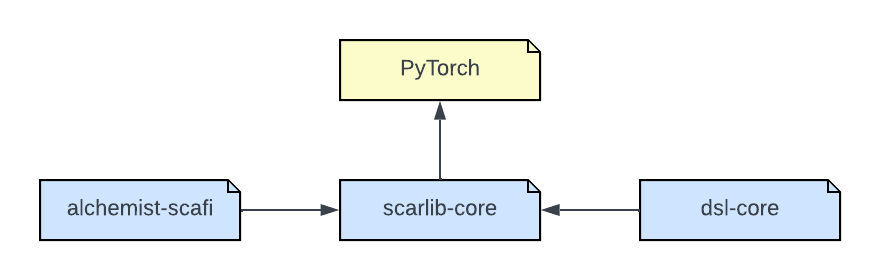

# Architectural design

The main objective of this project is to provide an easy-to-use and robust tool for CMARL system specification.
To achieve this goal, the framework incorporates numerous abstractions to model high-level aspects of the MARL domain, abstracting away low-level implementation details. The framework is composed of three primary modules: [scarlib-core](./scarlib-core), [alchemist-scafi](./alchemist-scafi), and [dsl-core](./dsl-core).

