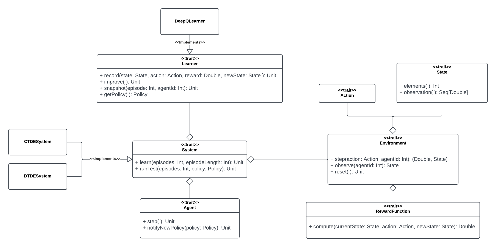
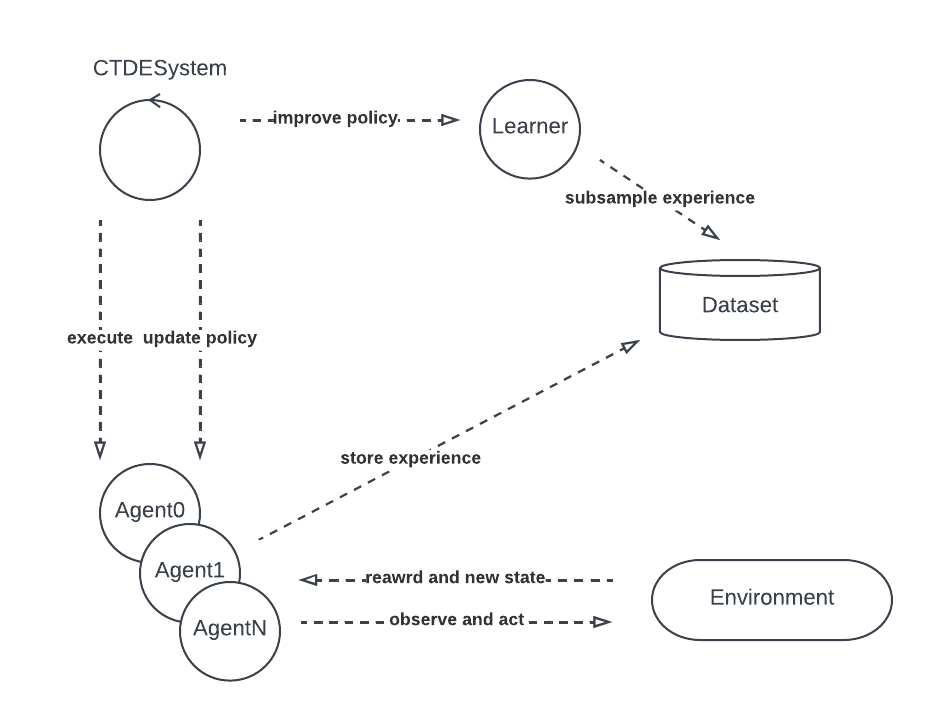
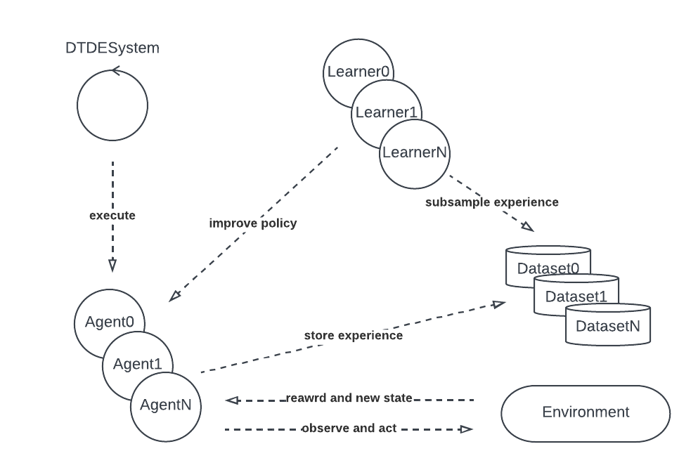
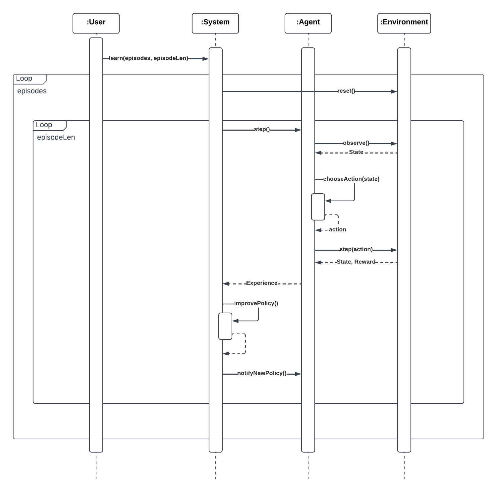
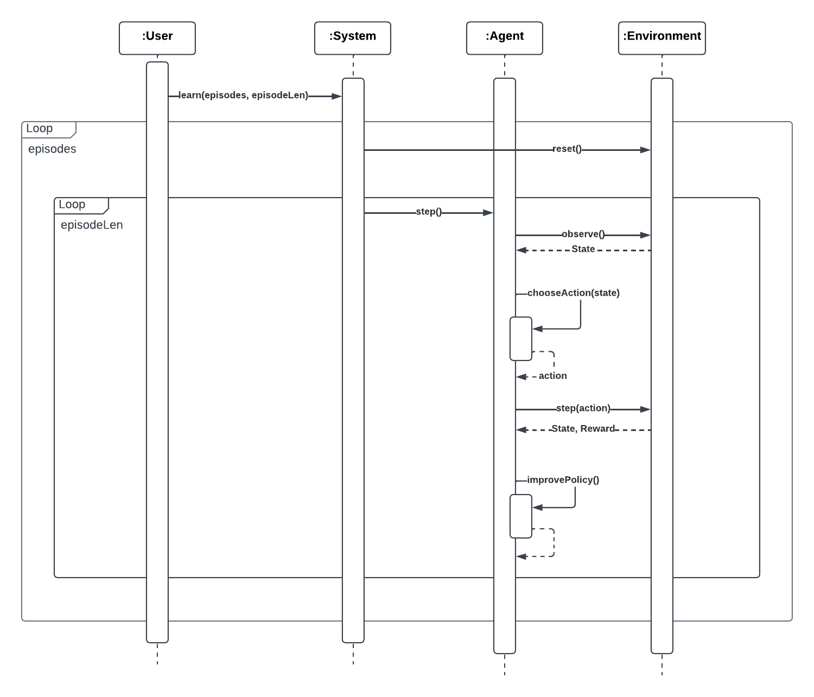
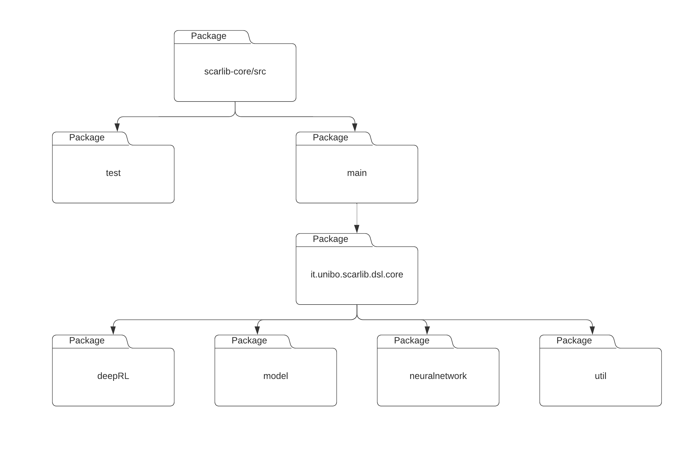

# scarlib-core

## Detailed design

The `scarlib-core` module implements the main functionalities and abstractions of the framework, including defining the main data structures and implementing the key algorithms.
The key element is the `System`, it defines the execution flow of the interactions between the agents and the entry point to start the simulation, both in learning and testing mode. 
Another important element is the `Learner`, it abstracts from the learning algorithm offering a common interface to improve the policy. Instead, the traits: `Environment`, `Action`, `State`, `RewardFunction` are those needed to define a custom experiment, the user must implement them to define his own task.

    <figure>
        
        <figcaption> scarlib-core architecture </figcaption>
    </figure>

This module offers two already implemented systems that are very common in the literature, namely: 
    i) Centralized Training Decentralized Execution System (`CTDESystem`), and
    ii) Decentralized Training Decentralized Execution System (`DTDESystem`).

To better understand the system's dynamics, it's helpful to explain some of the internals. Both systems use a training process that consists of multiple episodes, with each episode consisting of a predetermined number of time steps. During each episode, agents receive the current state and execute an action that causes the environment to move to the next state. At the end of an episode, the environment is reset, and agents are trained using the collected experience. In a `CTDESystem`, agents are trained in a centralized way, with a single central dataset and learner responsible for the training process and policy improvement. The `DTDESystem` works similarly, with each agent having its own dataset and learner.

<table cellspacing="2" cellpadding="2" border="0">
    <tbody>
        <tr>
            <td valign="top" >  </td>
            <td valign="top" >  </td>
        </tr>
    </tbody>
</table>

The behavior of these systems is depicted in more detail in the following two sequence diagrams, the first one represents a `CTDESystem`, while the second one represents a `DTDESystem`.

    <figure>
        
        <figcaption> CTDESystem sequence diagram </figcaption>
    </figure>

    <figure>
        
        <figcaption> DTDESystem sequence diagram </figcaption>
    </figure>

To support neural-network based Reinforcement Learning algorithms such as DQN, the module uses PyTorch as it is the de facto standard framework for building neural networks. The module relies on ScalaPy to interact directly with the Python API of PyTorch and other connected libraries. This integration involves setting up a Python environment and creating a Scala API that isolates what is necessary to access the Python ecosystem.

## Code structure

The code is divided in four packages, namely:  `model`, `deepRL`, `neuralnetwork` and `util`). 

- `deepRL` package contains the implementations of the two systems described above and of the related agents.

- `model` package contains the main abstractions and data structures, including the `Environment`, `Agent`, and `System`.
 
- `neuralnetwork` package contains the utilities for creating and using neural networks. 
 
- `util` package contains utility classes and functions. 
