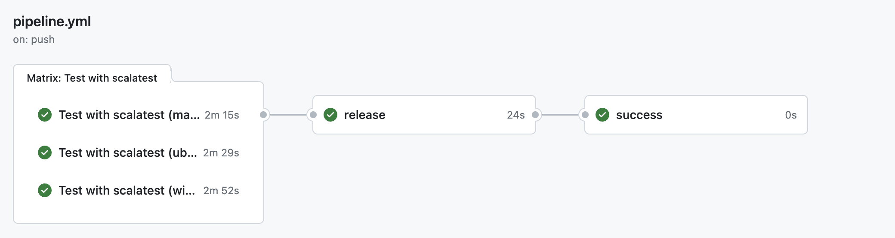

# Continuous Integration

Continuous Integration is an important practice in software development that involves frequently compiling, testing, and distributing source code to ensure that modifications do not introduce errors into existing software.

To automate this process, GitHub Actions were utilized.

The workflow has been divided into the following steps:
 1. `Test`: runs (on many operating systems) available tests for the ScaRLib project.
 2. `Release`: if tests were successful, the semantic-release tool is executed, which will automatically create a new release of the software if needed. 
 3. `Success`: checks if all previous jobs were successful, it is used for branch protection.

 

    <figure>
        
    </figure>

