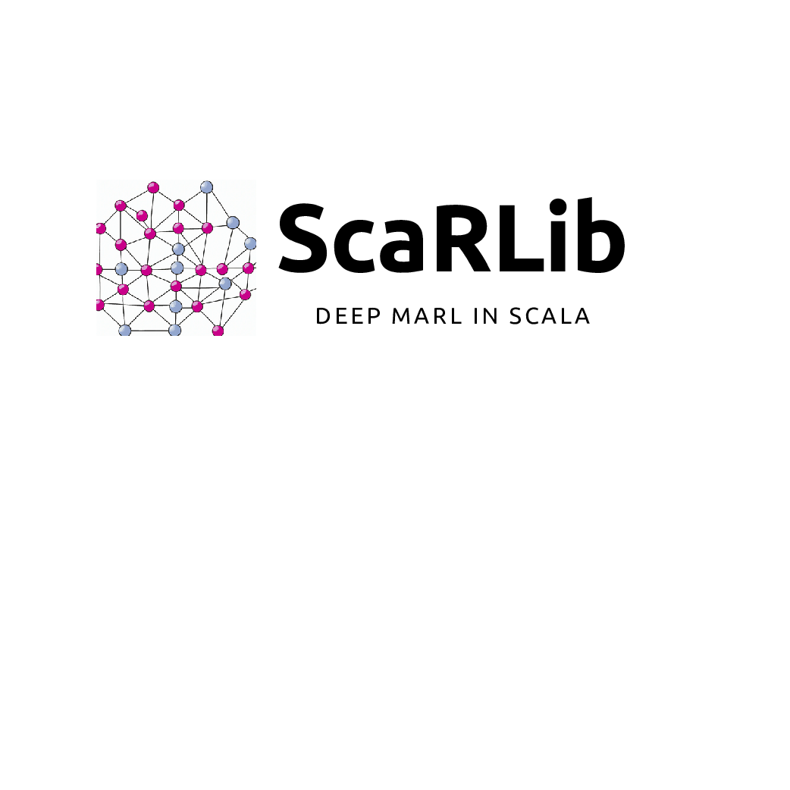

## ScaRLib

[ScaRLib] is a Scala Framework for cooperative many agents reinforcement learning (CMARL). 

The aim of this project is to develop a tool that relies on state-of-the-art deep learning libraries to support the definition of CMARL systems in JVM-based environments. Moreover, ScaRLib integrates [Scafi] programming framework and [Alchemist] simulator to enable learning of field-based coordination policies for large-scale systems.

----

### Main authors
- [Davide Domini](mailto:davide.domini2@unibo.it) (1025049) 
- [Filippo Cavallari](mailto:filippo.cavallari2@studio.unibo.it) (1025884)

[ScaRLib]: https://github.com/ScaRLib-group/ScaRLib
[Scafi]: https://scafi.github.io/
[Alchemist]: http://alchemistsimulator.github.io/